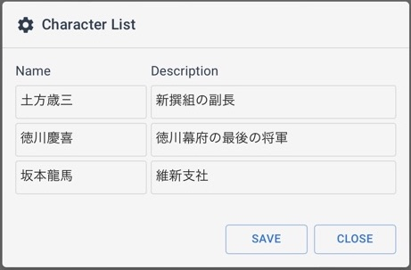

discussion-app
======

This is a discussion app that allows you to explore various viewpoints on specific topics. Simply provide a topic, and it will generate multiple responses based on different perspectives, enabling you to learn and understand various views. You can customize the attributes of each point of view or character. 

Expand your knowledge and broaden your understanding of different perspectives in an intuitive and interactive manner.

---

これは、特定のトピックについてさまざまな視点を探索できるディスカッションアプリです。トピックを入力するだけで、さまざまな視点に基づいて複数の回答を生成し、さまざまな視点を学習および理解できるようにします。各視点またはキャラクターの属性をカスタマイズできます。

直感的でインタラクティブな方法で、知識を広げ、さまざまな視点への理解を深めましょう。

---

This React application is built using Next.js 13 powered by the OpenAI Chat Completions API and supports Japanese language settings. (日本語対応)

# App

Sample screenshot

<picture>
  <source media="(prefers-color-scheme: light)" srcset="./docs/screenshot02.jpeg">
  <source media="(prefers-color-scheme: dark)" srcset="./docs/screenshot12.jpeg">
  
</picture>

Character list

<picture>
  <source media="(prefers-color-scheme: light)" srcset="./docs/screenshot01.png">
  <source media="(prefers-color-scheme: dark)" srcset="./docs/screenshot11.png">
  
</picture>

It is now possible to add new character or delete character.


# Custom Sample

Simulated discussion between characters from a galaxy far, far away

<picture>
  <source media="(prefers-color-scheme: light)" srcset="./docs/screenshot03.jpeg">
  <source media="(prefers-color-scheme: dark)" srcset="./docs/screenshot13.jpeg">
  
</picture>

Character list

<picture>
  <source media="(prefers-color-scheme: light)" srcset="./docs/screenshot04.jpeg">
  <source media="(prefers-color-scheme: dark)" srcset="./docs/screenshot14.jpeg">
  
</picture>

# Another Custom Sample - Japanese / 日本語

Simulated discussion between known figures of Japan's Bakumatsu period.

---

日本幕末期の著名な人物による模擬討論。

<picture>
  <source media="(prefers-color-scheme: light)" srcset="./docs/screenshot05.jpeg">
  <source media="(prefers-color-scheme: dark)" srcset="./docs/screenshot15.jpeg">
  
</picture>

Character list

---

登場人物一覧

<picture>
  <source media="(prefers-color-scheme: light)" srcset="./docs/screenshot06.jpeg">
  <source media="(prefers-color-scheme: dark)" srcset="./docs/screenshot16.jpeg">
  
</picture>

# Setup

Clone the repository and install the dependencies

```sh
git clone https://github.com/supershaneski/discussion-app.git myproject

cd myproject

npm install
```

Copy `.env.example` and rename it to `.env` then edit the `OPENAI_APIKEY` and use your own `OpenAI API key`.

```javascript
OPENAI_APIKEY=YOUR_OWN_API_KEY
```

Then run the app

```sh
npm run dev
```

Open your browser to `http://localhost:3007/` to load the application page.

